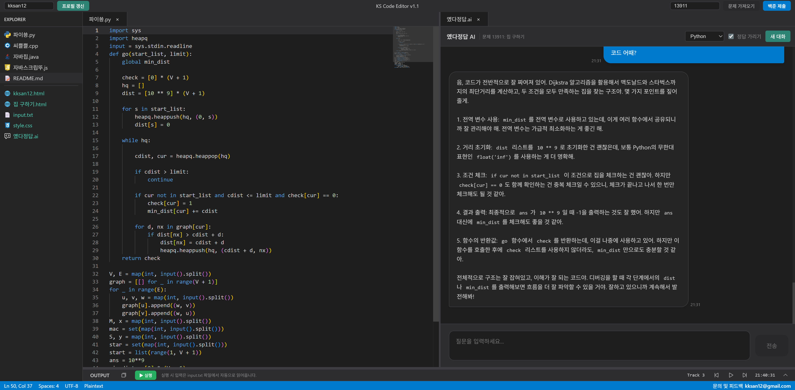

# KS Code Editor
[https://ks-code-editor.com](https://ks-code-editor.com)

백준(BOJ) 문제 풀이를 위한 웹 기반 코드 에디터입니다. Monaco Editor를 기반으로 하며, 문제 정보 자동 불러오기, 코드 실행, 프로필 조회 등 다양한 기능을 제공합니다.



## 주요 기능

### 에디터 기능
- **Monaco Editor 기반**: VS Code와 동일한 편집 경험
- **다중 파일 편집**: 여러 파일을 동시에 편집할 수 있는 탭 시스템
- **구문 강조**: 다양한 프로그래밍 언어 지원
- **자동 완성**: IntelliSense 기반 코드 자동 완성
- **코드 폴딩**: 코드 블록 접기/펼치기
- **탭 드래그 앤 드롭**: 탭을 드래그하여 에디터 그룹 간 이동
- **에디터 그룹**: 여러 에디터를 나란히 배치하여 작업, 너비 조절 가능

### 백준 문제 풀이
- **문제 자동 불러오기**: 백준 문제 번호로 문제 정보 자동 크롤링 (solved.ac API)
- **문제 미리보기**: HTML 형식으로 문제 내용 확인 (탭 더블 클릭으로 전환)
- **자동 입력**: 예제 입력 1을 `input.txt`에 자동 입력
- **백준 제출 연동**: 코드를 클립보드에 복사하고 백준 제출 페이지로 이동

### AI 챗봇 (옜다정답 AI)
- **맞춤형 도움**: solved.ac 프로필/티어와 문제 난이도를 반영해 난이도에 맞는 설명 제공
- **정답 가리기 모드**: 힌트·접근법만 제시하고 직접 정답 코드는 차단

### 사용자 프로필
- **프로필 조회**: solved.ac API를 통한 사용자 프로필 정보 표시
- **프로필 미리보기**: HTML 형식으로 프로필 확인 (탭 더블 클릭으로 전환)

### 커스터마이징
- **커스텀 테마**: CSS 변수를 통한 세부 테마 설정
- **테마 저장**: 설정한 테마를 localStorage에 자동 저장

### 코드 실행
- **Python**: Pyodide를 사용한 브라우저 내 실행
- **JavaScript**: 브라우저 네이티브 실행
- **입력 파일**: `input.txt` 파일을 통한 입력 처리

### 데이터 저장
- **자동 저장**: 파일 내용, 탭 상태, 에디터 그룹 등 자동 저장
- **localStorage 기반**: 브라우저 localStorage를 활용한 데이터 영속성

## 시작하기

### 필수 요구사항
- Node.js 18.0 이상
- npm 또는 yarn

### 설치

```bash
# 저장소 클론
git clone https://github.com/sani0928/ks-code-editor.git

# 디렉토리 이동
cd ks-code-editor

# 의존성 설치
npm install
```

### 실행

```bash
# 개발 서버 실행
npm run dev

# 프로덕션 빌드
npm run build

# 프로덕션 서버 실행
npm start
```

브라우저에서 [http://localhost:3000](http://localhost:3000)을 열어 사용할 수 있습니다.

## 키보드 단축키

### 편집 단축키
- `Ctrl + Z`: 실행 취소 (Undo)
- `Ctrl + Shift + Z`: 다시 실행 (Redo)
- `Ctrl + Y`: 다시 실행 (Redo)
- `Ctrl + 휠`: 에디터 확대/축소

### 파일 단축키
- `Ctrl + S`: 코드 파일 다운로드 (코드 파일만 해당)

## 사용 방법

### 1. 문제 불러오기
1. 상단 헤더의 문제 번호 입력란에 백준 문제 번호 입력
2. "문제 가져오기" 버튼 클릭
3. 문제 정보가 자동으로 불러와지고 `(문제 이름).html` 파일이 생성됨
4. 탭을 더블 클릭하여 문제 미리보기/코드 편집 모드 전환

### 2. 코드 작성 및 실행
1. 파일 탐색기에서 원하는 언어 파일 선택 (예: `파이쑝.py`)
2. 코드 작성
3. `input.txt`에 입력 값 작성 (문제 불러오기 시 자동 입력됨)
4. "Run" 버튼 클릭하여 코드 실행
5. OUTPUT 패널에서 결과 확인

### 3. 백준 제출
1. 코드 작성 완료 후 "백준 제출" 버튼 클릭
2. 코드가 클립보드에 복사되고 백준 제출 페이지가 새 탭에서 열림
3. 백준 제출 페이지에서 `Ctrl + V`로 코드 붙여넣기

### 4. 프로필 조회
1. 상단 헤더의 사용자 아이디 입력란에 solved.ac 아이디 입력
2. "프로필 갱신" 버튼 클릭
3. 프로필 정보가 `(사용자 아이디).html` 파일로 생성됨
4. 탭을 더블 클릭하여 프로필 미리보기/코드 편집 모드 전환

### 5. AI 챗봇 사용
1. 챗봇(옜다정답 AI) 탭을 클릭
2. 챗봇 입력란에 문제에 대한질문 입력 후 전송
4. 챗봇 응답이 표시됨

### 6. 테마 커스터마이징
1. 파일 탐색기에서 `style.css` 파일 열기
2. CSS 변수 값을 수정하여 원하는 테마 색상 설정
3. 변경사항이 자동으로 적용됨

## 기술 스택

- **프레임워크**: [Next.js](https://nextjs.org/) 14.0
- **UI 라이브러리**: [React](https://react.dev/) 18.2
- **에디터**: [Monaco Editor](https://microsoft.github.io/monaco-editor/) (VS Code 에디터)
- **드래그 앤 드롭**: [react-dnd](https://react-dnd.github.io/react-dnd/)
- **Python 실행**: [Pyodide](https://pyodide.org/)
- **HTML 파싱**: [cheerio](https://cheerio.js.org/)
- **AI 챗봇**: [OpenAI API](https://openai.com/api/)

## 지원 언어

### 코드 실행
- Python (Pyodide)
- JavaScript (브라우저 네이티브)
- C++ (추후 구현 예정)
- Java (추후 구현 예정)

### 구문 강조
- Python, JavaScript, TypeScript
- C++, C, Java
- HTML, CSS, Markdown
- 기타 다양한 언어 지원

## 버전 히스토리

### v 1.1 (2025-12-09)
- **에디터 그룹 너비 조절**: 두 개의 에디터 그룹 사이에 슬라이더를 추가하여 너비를 자유롭게 조절할 수 있습니다
- **코드 자동 저장**: 코드 파일(.py, .cpp, .java, .js)이 변경될 때마다 localStorage에 자동 저장되며, 새로고침해도 코드가 유지됩니다
- **디지털 시계**: OUTPUT 패널 헤더 우측에 현재 시간(AM/PM 00:00:00 형식)이 실시간으로 표시됩니다
- **뮤직 플레이어**: 코딩을 하며 집중하기 좋은 무드의 곡들을 감상할 수 있도록 뮤직 플레이어를 추가했습니다.
- **html 렌더링 방식 변경**: 기존 iframe 독립 컨텍스트으로 보여주던 html 미리보기 기능을 Shadow DOM 방식으로 변경하여 실제 html/css를 직접 파싱하였습니다. 이를 통해 재로딩을 거쳐야했던 iframe 오버헤드를 제거하고, Shadow DOM 업데이트로 구조를 단순화하였습니다. 또한 에디터 그룹 너비 조정 중 마우스가 iframe 영역에 들어가면 마우스 이벤트를 가로채는 문제를 해결하고, CSS 파일(`style.css`) 자동 연동으로 코드의 직관성을 향상하였습니다.

### v 1.2
- **AI 챗복 기능 추가**: 편리한 알고리즘 공부를 도와주는 AI 챗봇 '옜다정답'을 추가하였습니다. OpenAI의 GPT 4o mini 모델을 사용하며, 문제 풀이, 코드 리뷰, 정답 가리기 모드 등 다양한 기능을 제공합니다.
- **html 미리보기 가독성 개선**: 문자 정렬 및 색상을 수정하여 가독성을 향상했습니다.
- **style.css 변수 재조정**: 변수를 디테일하게 세분화해 더욱 다양한 커스텀 테마 조절이 가능하게 수정하였습니다.
- **코드 최적화**: 중복된 함수를 통합하고, 불필요한 레거시 코드를 제거하였습니다.

## 문의

문의사항이나 피드백이 있으시면 아래 이메일로 연락해주세요.
> **이메일**: [kksan12@gmail.com](mailto:kksan12@gmail.com)